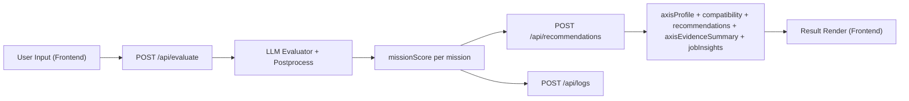

# JOBSIM 경계 확정 (v1)

기준일: 2026-05-26  
목표: 유지보수/개선 전에 책임 경계와 데이터 계약을 먼저 고정한다.

## 1) 책임 경계 (확정)

### 백엔드 (`server.ts`, `src/lib/**`)
- 미션/정적 리소스 제공
- 평가 API: `POST /api/evaluate`
- 결과 집계 API: `POST /api/recommendations`
- 로그 저장 API: `POST /api/logs`
- 계약(스키마) 검증 실패 시 `400`, 서버 내부 불일치 시 `500` 반환

### 프론트 (`app/index.html`)
- 화면 렌더링, 사용자 입력, 상태 전환
- 미션 답변 제출 및 결과 표시
- 계산 자체(적합도/추천/증거요약/사분면)는 수행하지 않고 백엔드 응답을 렌더

### LLM 계층 (`src/lib/evaluator/**`)
- 프롬프트/스키마 기반 평가
- 근거 검증/후처리/fallback
- 평가 결과를 표준 형태(`evaluation`, `missionScore`)로 반환

## 2) API 계약 (확정)

실제 계약 코드는 아래 파일을 단일 기준으로 사용:

- `/Users/imhyeongjun/Desktop/Coding/Project/Test_project-main/src/lib/api/contracts.ts`

핵심 엔드포인트:
- `POST /api/evaluate`
- `POST /api/recommendations`
- `POST /api/logs`

에러 포맷:
```json
{
  "error": {
    "code": "STRING_CODE",
    "message": "human readable message",
    "details": []
  }
}
```

## 3) 데이터 흐름 (확정)



## 4) 현재 모름/미확정 (명시)

아래는 아직 결정되지 않았거나 코드 기준으로 확정하기 어려운 항목:

1. 사용자 인증/권한 모델
2. 다중 사용자 동시 접속에서의 세션 식별 전략
3. 운영 DB 선택(JSONL 유지 vs RDB 전환)
4. 로그 보관 기간/마스킹 정책(개인정보 기준)
5. 모델 라우팅 정책(단일 모델 vs 조건부 모델)

## 5) 다음 우선순위

1. 이 계약을 CI에 고정: 계약 위반 시 실패
2. 로그 저장소를 파일(JSONL)에서 운영 DB로 분리
3. 프론트 모듈 구조 세분화 (`components/state/api-client` 분리 완료, 화면별 컴포넌트 추가 분리 진행)
